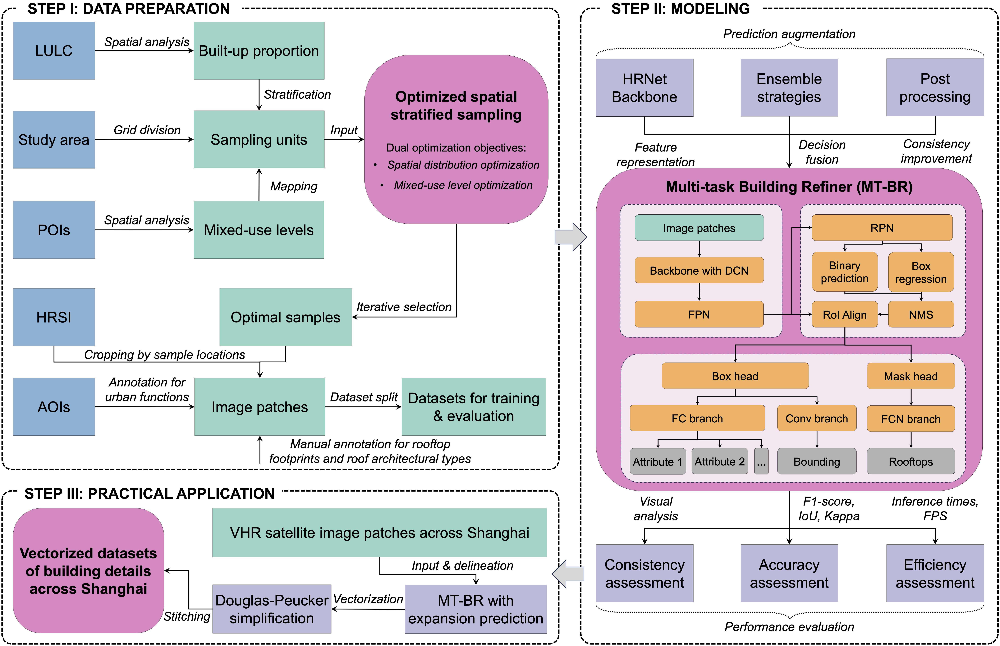
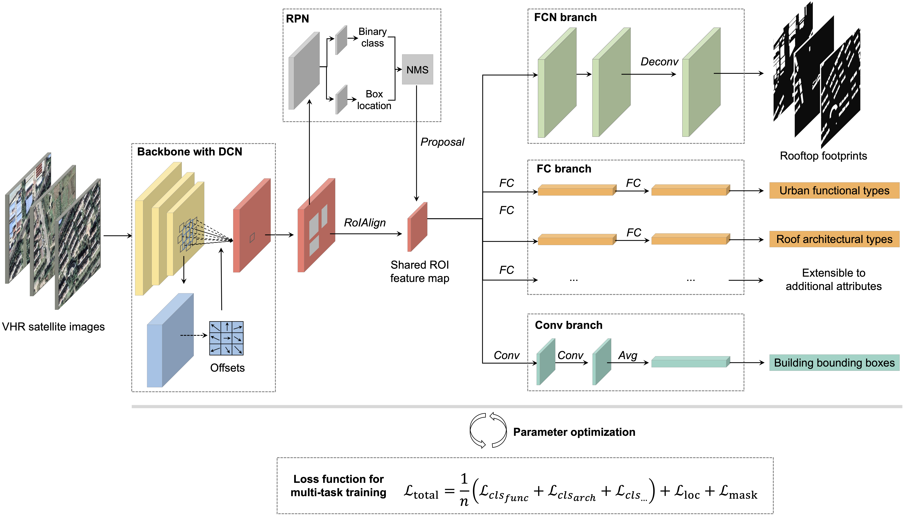

# Multi-task deep learning for large-scale building detail extraction from high-resolution satellite imagery

Understanding urban dynamics and promoting sustainable development requires comprehensive insights about buildings, including their spatial locations, rooftop configurations, physical forms, and urban functions. While geospatial artificial intelligence has advanced the extraction of such details from Earth observational data, existing methods often suffer from computational inefficiencies and inconsistencies when compiling unified building-related datasets for practical applications. To bridge this gap, we introduce the Multi-task Building Refiner (MT-BR), an adaptable neural network tailored for simultaneous extraction of spatial and attributional building details from high-resolution satellite imagery, exemplified by building rooftops, urban functional types, and roof architectural types. Notably, MT-BR can be fine-tuned to incorporate additional building details, extending its applicability. For large-scale applications, we devise a novel spatial sampling scheme that strategically selects limited but representative image samples. This process optimizes both the spatial distribution of samples and the urban environmental characteristics they contain, thus enhancing extraction effectiveness while curtailing data preparation expenditures. We further enhance MT-BR’s predictive performance and generalization capabilities through the integration of advanced augmentation techniques. Our quantitative results highlight the efficacy of the proposed methods. Specifically, networks trained with datasets curated via our sampling method demonstrate improved predictive accuracy relative to those using alternative sampling approaches, with no alterations to network architecture. Moreover, MT-BR consistently outperforms other state-of-the-art methods in extracting building details across various metrics, achieving gains between 2% and 20%, with a further 5% improvement when augmentation strategies were adopted. The real-world practicality of our approaches is also demonstrated in an application across Shanghai, generating a unified dataset that encompasses both the spatial and attributional details of buildings. This endeavor also underscores our methodology's potential contribution to urban studies and sustainable development initiatives.

Fig. 1. Flowchart of the proposed methods. The process is divided into three phases: 1) preparation of representative datasets, 2) development of a multi-task deep learning network, and 3) large-scale application of the proposed methods for building identification. The segments highlighted in pink indicate the three primary contributions of our study. LULC is land use and land cover data. POIs are points of interest data. HRSI is high-resolution satellite imagery. AOIs are areas of interest data. DCN is deformable convolutional network. FPN is feature pyramid network. RPN is region proposal network. RoI is region of interest. NMS is non-maximum suppression. FC is fully connected operation. Conv is convolutional operation. FCN is fully convolutional network.

# Overview of MT-BR

Fig. 2. Overview of the MT-BR architecture. The network utilizes a Deformable Convolutional Network (DCN) to accommodate buildings of various scales and shapes. Its scalable branches, characterized by an integrated use of convolutional (Conv) and fully connected (FC) layers, are crafted within a multi-task learning paradigm, allowing for the concurrent extraction of various building details. The custom-designed loss function facilitates multi-task learning and can be expanded to accommodate additional building information extraction tasks. RPN is region proposal network. RoI is region-of-interest. NMS is non-maximum suppression. FC is full connected operation. Avg is average pooling. Deconv is deconvolutional operation.

# The generated building detail dataset across Shanghai, China

Fig. 18. Building details delineated in Shanghai. (a) Urban functional types associated with rooftops. (b) Roof architectural types associated with rooftops.

# Availability

1. We developed MT-BR using Python 3.9 and MMdetection 2.28.1. The primary codes can be found in the __Code__ folder. The MMdetection framework is comprehensive; we modified and supplemented codes to realize MT-BR. Please focus on the following scripts:
   - mmdet/models/roi_heads/bbox_heads/multiple_bbox_head.py
   - mmdet/models/roi_heads/bbox_heads/multiple_bbox_head_allfc.py
   - mmdet/models/roi_heads/bbox_heads/__init__.py
   - mmdet/models/roi_heads/multiple_roi_head.py
   - mmdet/models/roi_heads/__init__.py
   - mmdet/models/roi_heads/test_mixins.py
   - mmdet/models/roi_heads/mask_heads/__init__.py
   - mmdet/models/roi_heads/mask_heads/multitask_fcn_mask_head.py
   - mmdet/core/post_processing/bbox_nms.py
   - mmdet/core/post_processing/__init__.py
   - mmdet/core/post_processing/merge_augs.py
   - mmdet/core/bbox/assigners/max_iou_assigner.py
   - mmdet/datasets/api_wrappers/__init__.py
   - mmdet/datasets/api_wrappers/coco_multitask.py
   - mmdet/datasets/api_wrappers/coco_api.py
   - pycocotools/coco.py

2. The generated dataset is available at [this Google Drive link](https://drive.google.com/drive/folders/1vlqWawFdINglfgIYS-KoOpiYP47THuf_). It has been vectorized and stored in GeoPackage format. The dataset includes 1.77 million building entities, each associated with its respective urban functional type and roof architectural type.

# Citation